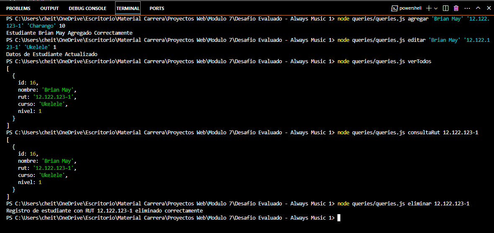

# Desafío Evaluado, Modulo VII - Always Music 1.

## Descripción del proyecto

Validación conocimientos de Instalación y configuración de la librería pg, Propiedades del objeto result y la asincronía en una consulta, Ingresando y consultando datos, como también Actualizando y eliminando datos.

## Prerrequisitos o Dependencias
- Windows, Mac, Linux.
- Javascript, PostgreSQL, Node.js.
- Visual Studio Code.
- PGAdmin.

### Para inicializar el programa se requiere:

1. Instalar las dependencias PG y DOTENV usadas con el comando `npm i pg dotenv`.
2. Se requiere crear una database en postgres usando las consultas en la carpeta SQL.
3. Crear un archivo `.env` con las variables de entorno necesarias (DB_USER, DB_PASSWORD, DB_HOST, DB_PORT, DB_DATABASE).

### Comandos aceptados

1. `npm queries/queries.js agregar` - Este parámetro acepta 4 argumentos (Nombre, Rut, Curso, y Nivel) y crea un nuevo estudiante en la base de datos.
2. `npm queries/queries.js consultaRut` - Lista el estudiante en base al rut.
3. `npm queries/queries.js verTodos` - Lista todos los estudiantes registrados.
4. `npm queries/queries.js editar` - Este parámetro acepta 4 argumentos (Nombre, Rut, Curso y Nivel) y edita el estudiante en la base de datos.
5. `npm queries/queries.js eliminar` - Este parámetro acepta 1 argumento (Rut) y elimina un estudiante.

### Ejemplo de uso

## Licencia

Este proyecto está bajo la Licencia MIT - ve el archivo [LICENSE.md](LICENSE) para detalles

---

## Eric Arancibia (https://github.com/ericarancibia) - G68 Desarrollo Aplicaciones Full Stack JavaScript. Talento Digital - Academia Desafío Latam